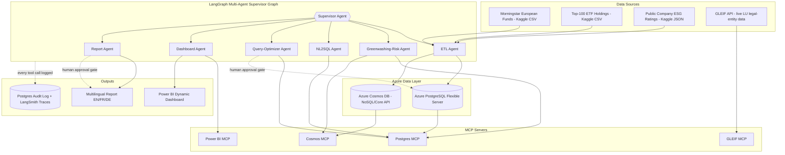

# GreenLux Sentinel

**Agentic Greenwashing-Risk Intelligence for Luxembourg-Domiciled Investment Funds**

A multi-agent system that flags the gap between what a fund *claims* about its sustainability
(Morningstar Sustainability Rating) and what its actual holdings *look like* (weighted ESG
profile of real constituent companies) — then explains the gap, lets an analyst query it in
natural language, renders it as a live-updating Power BI dashboard, and drafts a multilingual
(EN/FR/DE) report, all under audit logging and human-in-the-loop approval.

Built as a portfolio project targeting the Luxembourg investment-fund industry, where the CSSF's
2026 supervisory priorities explicitly call out anti-greenwashing controls and consistency between
SFDR disclosures and marketing materials — see [docs/DATA.md](docs/DATA.md#why-this-topic) for
sourcing.

> **Status:** Phases 0-3 complete (data pipeline, core agents, MCP servers) — see
> [docs/ROADMAP.md](docs/ROADMAP.md) for what's built vs. planned and
> [docs/PROGRESS_LOG.md](docs/PROGRESS_LOG.md) for session-by-session detail.

## Why this exists

Sibling project [agentic-rag-lu](https://github.com/BDelfanian/agentic-rag-lu) covers Luxembourg
fund **compliance QA** via GraphRAG (OpenAI Responses API, Cosmos DB Gremlin, regulatory text
retrieval). This project deliberately covers different ground: **quantitative risk analytics**
over structured fund data, orchestrated with LangGraph/LangChain/LangSmith instead of native
function-calling, using Cosmos DB's document API instead of its graph API, with MCP-exposed tools
instead of native tool-calling, and a Power BI + report deliverable instead of a chat UI. Full
diff in [docs/ARCHITECTURE.md](docs/ARCHITECTURE.md#differentiation-from-agentic-rag-lu).

## Architecture at a glance



## Documentation map

| Doc | Purpose |
|---|---|
| [CLAUDE.md](CLAUDE.md) | Persistent context for AI-assisted work in this repo — read this first in any new session |
| [docs/ARCHITECTURE.md](docs/ARCHITECTURE.md) | Agent graph, MCP server contracts, Azure service map, differentiation rationale |
| [docs/DATA.md](docs/DATA.md) | Datasets, schemas, the two-tier data design, why the topic is real and current |
| [docs/REQUIREMENTS_TRACEABILITY.md](docs/REQUIREMENTS_TRACEABILITY.md) | Every original project requirement mapped to the feature that satisfies it |
| [docs/RESPONSIBLE_AI.md](docs/RESPONSIBLE_AI.md) | Guardrails, audit logging, human-in-the-loop gate design |
| [docs/ROADMAP.md](docs/ROADMAP.md) | Phased milestones, current status |
| [docs/PROGRESS_LOG.md](docs/PROGRESS_LOG.md) | Append-only session history — what was done, deviations from plan, next step (newest first) |

## Tech stack

- **Agentic:** LangGraph (orchestration), LangChain (tools/chains), LangSmith (tracing/eval), MCP (tool servers)
- **Data:** Azure Database for PostgreSQL Flexible Server, Azure Cosmos DB (NoSQL/Core API)
- **ML:** greenwashing-risk scoring model (holdings-vs-claim consistency)
- **BI:** Power BI, agent-driven dynamic report/dataset queries (not static dashboards)
- **Cloud:** Microsoft Azure (see [docs/ARCHITECTURE.md](docs/ARCHITECTURE.md#azure-service-map) for the full service list)
- **Language:** Python 3.12

## Getting started

Not runnable yet — this is the scaffolding commit. See [docs/ROADMAP.md](docs/ROADMAP.md) for
the build order. Once the data layer lands:

```powershell
python -m venv .venv
.venv\Scripts\Activate.ps1
pip install -e .
copy .env.example .env   # fill in Azure connection strings and API keys
```

## License

MIT — see [LICENSE](LICENSE).
