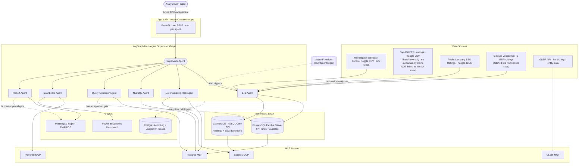
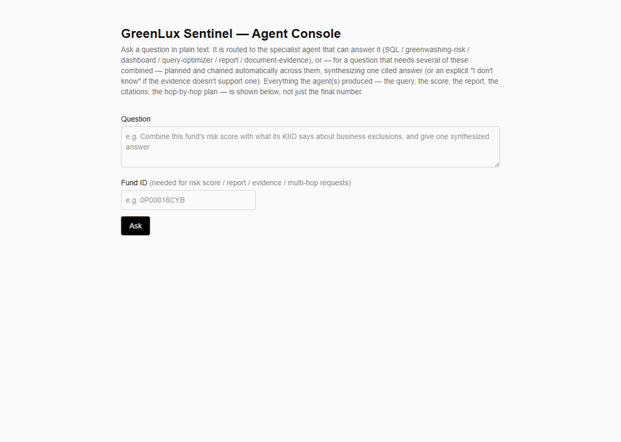

# GreenLux Sentinel

**Agentic Greenwashing-Risk Intelligence for Luxembourg-Domiciled Investment Funds**

A multi-agent system that flags the gap between what a fund *claims* about its sustainability
(Morningstar Sustainability Rating) and what its actual holdings *look like* (weighted ESG
profile of real constituent companies) — then explains the gap, lets an analyst query it in
natural language, renders it as a live-updating Power BI dashboard, and drafts a multilingual
(EN/FR/DE) report, all under audit logging and human-in-the-loop approval.

Built as a portfolio project targeting the Luxembourg investment-fund industry, where the CSSF's
2026 supervisory priorities explicitly call out anti-greenwashing controls and consistency between
SFDR disclosures and marketing materials — see [docs/DATA.md](docs/DATA.md#why-this-topic) for
sourcing.

> **Status:** Phases 0-7 complete and live-deployed. Phase 8 (document-evidence agent + multi-hop
> orchestration) is in progress — 8a-8d built and verified locally, 8e (live Azure deployment)
> pending. See [docs/ROADMAP.md](docs/ROADMAP.md) for what's built vs. planned and
> [docs/PROGRESS_LOG.md](docs/PROGRESS_LOG.md) for session-by-session detail.

## Why this exists

Sibling project [agentic-rag-lu](https://github.com/BDelfanian/agentic-rag-lu) covers Luxembourg
fund **compliance QA** via full GraphRAG (hand-built Cosmos DB Gremlin graph, OpenAI Responses
API, open-ended regulatory-text retrieval and chat). This project's core is **quantitative risk
analytics** over structured fund data, orchestrated with LangGraph/LangChain/LangSmith instead of
native function-calling, using Cosmos DB's document API instead of its graph API, with
MCP-exposed tools instead of native tool-calling, and a Power BI + report deliverable instead of
open-ended chat.

**Phase 8 update:** the tool now also retrieves and cites real documents (fund disclosures +
general SFDR/CSSF regulatory text) via Azure AI Search — the same service the sibling project
uses — to answer questions a structured-data-only agent can't, abstaining explicitly when
evidence is missing. That overlap with the sibling's document domain is real and deliberate, not
an oversight; what still differentiates the two is *how* the documents are used: fused with
structured fund analytics into one synthesized, cited-or-abstaining answer via a fixed
LangGraph pipeline (including supervisor-planned multi-hop chaining across specialists), not an
open-ended graph-traversal chat interface. No graph database or entity-relationship construction
here either — deliberately scoped down for an 11-document corpus with no hidden structure to
discover (see [docs/DATA.md](docs/DATA.md#document-corpus-phase-8)). The operator UI (`ui/`)
stays a structured, single-request-in/full-result-out client, now over seven fixed specialist
agents — not a conversational surface. Full diff in
[docs/ARCHITECTURE.md](docs/ARCHITECTURE.md#differentiation-from-agentic-rag-lu).

## Architecture at a glance



The risk score is computed only for the 5 issuer-verified ETFs (A4) — the original "Top-100 ETF
Holdings" dataset (A2) turned out to have zero ticker overlap with the Tier 1 fund table and no
sustainability claim of its own, so it's kept only as a separate, unlinked descriptive dataset.
See [CLAUDE.md](CLAUDE.md#decisions-that-must-not-be-quietly-reverted) decision 2 and
[docs/DATA.md](docs/DATA.md#tier-2-verified-holdings-phase-2-correction) for the full story.

## Demo



Real output from the Agent API (same FastAPI app deployed on Azure Container Apps) running
against the local Postgres + Cosmos dev stack: a fund claiming a 5/5-globe Morningstar
Sustainability Rating scores 54.31 (large claim-vs-holdings gap), vs. 2.48 for a plain S&P 500
tracker with no sustainability claim at all — the core signal this project surfaces.

## Deployment

Live on Azure — 11 distinct services, see [docs/ARCHITECTURE.md](docs/ARCHITECTURE.md#azure-service-map)
for the full map. CI (`.github/workflows/ci.yml`) runs lint + tests on every push/PR. A separate
deploy-on-merge workflow (`.github/workflows/deploy.yml`) rebuilds and redeploys the agent API
image and the ETL Function App package on every push to `main` that touches app code, gated by a
required manual approval — **app-level only**: it deliberately does not apply `infra/*.bicep`
changes, since that would need a materially bigger RBAC grant (`User Access Administrator` + Key
Vault read) than what was agreed. Infra changes stay a manual `az deployment group create` step.

## Documentation map

| Doc | Purpose |
|---|---|
| [CLAUDE.md](CLAUDE.md) | Persistent context for AI-assisted work in this repo — read this first in any new session |
| [docs/ARCHITECTURE.md](docs/ARCHITECTURE.md) | Agent graph, MCP server contracts, Azure service map, differentiation rationale |
| [docs/DATA.md](docs/DATA.md) | Datasets, schemas, the two-tier data design, why the topic is real and current |
| [docs/REQUIREMENTS_TRACEABILITY.md](docs/REQUIREMENTS_TRACEABILITY.md) | Every original project requirement mapped to the feature that satisfies it |
| [docs/RESPONSIBLE_AI.md](docs/RESPONSIBLE_AI.md) | Guardrails, audit logging, human-in-the-loop gate design |
| [docs/ROADMAP.md](docs/ROADMAP.md) | Phased milestones, current status |
| [docs/PROGRESS_LOG.md](docs/PROGRESS_LOG.md) | Append-only session history — what was done, deviations from plan, next step (newest first) |

## Tech stack

- **Agentic:** LangGraph (orchestration), LangChain (tools/chains), LangSmith (tracing/eval), MCP (tool servers)
- **Data:** Azure Database for PostgreSQL Flexible Server, Azure Cosmos DB (NoSQL/Core API)
- **ML:** greenwashing-risk scoring model (holdings-vs-claim consistency)
- **BI:** Power BI, agent-driven dynamic report/dataset queries (not static dashboards)
- **Cloud:** Microsoft Azure (see [docs/ARCHITECTURE.md](docs/ARCHITECTURE.md#azure-service-map) for the full service list)
- **Language:** Python 3.12

## Getting started

Local dev runs against Postgres + a Cosmos DB NoSQL emulator in Docker, the same config surface
(`config.py`) that the live Azure deployment uses:

```powershell
.\scripts\setup_env.ps1               # venv, pip install -e ".[dev]", .env from .env.example
docker compose up -d                  # local Postgres + Cosmos NoSQL emulator
# fill in .env: Azure OpenAI, LangSmith, Power BI, etc. (Postgres/Cosmos already point at Docker)
uvicorn greenlux_sentinel.api.app:app --reload   # Agent API on http://localhost:8000
```

See [docs/ARCHITECTURE.md](docs/ARCHITECTURE.md#agent-api) for the full route list, or hit the
live-deployed Container App directly via its APIM gateway if you have the auth token.

To drive it from a browser instead of curl, with the full agent-level detail (generated query,
risk explanation, report body, citations) rendered rather than just a JSON blob, run the operator
UI alongside the Agent API above:

```powershell
cd ui
npm install
cp .env.local.example .env.local   # AGENT_API_URL=http://localhost:8000 by default
npm run dev                        # http://localhost:3000
```

## License

MIT — see [LICENSE](LICENSE).
