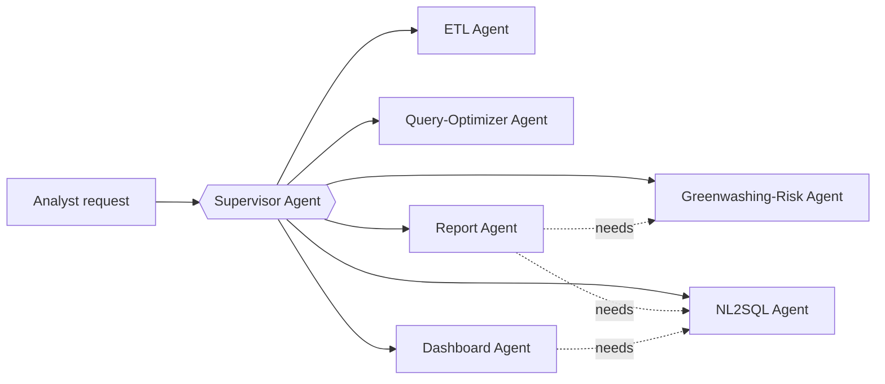

# Architecture

## Agent graph (LangGraph)

A single supervisor graph coordinates six specialist agents. All agent-to-tool calls go through
MCP servers (never direct SDK calls from agent code) so tool access is uniform, inspectable, and
swappable.

| Agent | Responsibility | Tools (via MCP) | Human gate? |
|---|---|---|---|
| Supervisor | Routes analyst requests to the right specialist(s); merges results | none directly | no |
| ETL Agent | Ingests Kaggle sources + GLEIF API, resolves schema drift, writes lineage log | Postgres MCP, Cosmos MCP, GLEIF MCP | no |
| Greenwashing-Risk Agent | Computes the risk score per fund, explains the driving holdings | Postgres MCP, Cosmos MCP | no (read-only) |
| NL2SQL Agent | Translates analyst questions into SQL against the fund schema | Postgres MCP | no (read-only) |
| Query-Optimizer Agent | Reads `EXPLAIN ANALYZE` output, proposes/creates indexes | Postgres MCP (DDL) | **yes** — schema changes require approval |
| Dashboard Agent | Turns an analyst question into a DAX/Power BI query, updates the live dashboard | Power BI MCP | no (read-only refresh) |
| Report Agent | Compiles risk score + SQL findings into a cited, multilingual report | Postgres MCP, Cosmos MCP | **yes** — publishing requires approval |

## MCP servers

Each server wraps one system and exposes a small, explicit tool surface — no server should
expose raw query execution without validation.

- **`postgres_server`** — tools: `run_readonly_query(sql)`, `explain_query(sql)`,
  `propose_index(ddl)` (queued for approval, not auto-applied), `write_audit_log(entry)`
- **`cosmos_server`** — tools: `get_company_esg(ticker)`, `query_esg_documents(filter)`
- **`powerbi_server`** — tools: `run_dax_query(dataset_id, dax)`, `refresh_dataset(dataset_id)`
- **`gleif_server`** — tools: `lookup_lei(name_or_lei)`, `search_lu_entities(entity_type)`

## Data layer

See [DATA.md](DATA.md) for the full dataset breakdown. In short:

- **Azure Database for PostgreSQL Flexible Server** — the ~67k-row Morningstar European Funds
  table (breadth: BI + agentic SQL live here) plus the audit-log table.
- **Azure Cosmos DB (NoSQL/Core API)** — nested JSON documents: ETF holdings joined to
  company-level ESG ratings (depth: the risk model runs here). **Not** the Gremlin API — see
  [CLAUDE.md](../CLAUDE.md) for why that distinction matters.

## Azure service map

| Service | Role |
|---|---|
| Azure Database for PostgreSQL Flexible Server | Relational fund data + audit log |
| Azure Cosmos DB (NoSQL API) | ESG holdings documents |
| Azure Blob Storage / ADLS Gen2 | Raw Kaggle files, landing zone before ETL |
| Azure Data Factory or Azure Functions (timer-triggered) | Scheduled ETL orchestration |
| Azure AI Foundry (Azure OpenAI models) | LLM backing all agents |
| Azure Container Apps | Hosts the LangGraph service + MCP servers |
| Azure API Management | Fronts the agent API |
| Azure Key Vault | Secrets: DB connection strings, API keys, PBI service principal |
| Azure Monitor + Log Analytics | Infra/app logging, feeds the audit trail alongside LangSmith |
| Microsoft Entra ID | Auth for the operator-facing surface and service principals |
| Power BI Service | Hosts the dynamic dashboard; agent talks to it via the Power BI REST API/XMLA |
| GitHub Actions | CI/CD (lint, test, deploy on merge) |

## Differentiation from agentic-rag-lu

See [CLAUDE.md](../CLAUDE.md#decisions-that-must-not-be-quietly-reverted) for the definitive list
of "don't rebuild this" boundaries. Summary table:

| | agentic-rag-lu | GreenLux Sentinel |
|---|---|---|
| Method | GraphRAG + vector RAG over regulatory text | Quantitative multi-agent analytics over structured data |
| Orchestration | OpenAI Responses API, native function-calling | LangGraph + LangChain + LangSmith |
| Cosmos DB API | Gremlin (graph) | NoSQL/Core (document) |
| Question shape | "Which sub-funds are Article 8, what does CSSF guidance say?" | "Is this fund's claim consistent with its holdings?" |
| Surface | Next.js chat UI + graph visualization | Power BI dashboard + generated report |
| MCP | Not used | Core requirement |

## Guardrails and human-in-the-loop

Detailed in [RESPONSIBLE_AI.md](RESPONSIBLE_AI.md). The short version: every agent tool call is
logged (Postgres audit table + LangSmith trace); numeric claims in the report must trace back to
a tool call result, not free-generated text; and the two write-capable agents (query-optimizer,
report) stop for human approval before their output takes effect.
