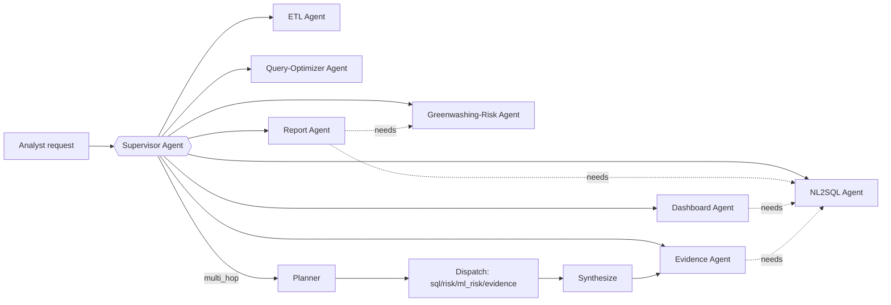

# Architecture

## Agent graph (LangGraph)

A single supervisor graph coordinates eight specialist agents (seven routable + one
plannable-hop-only, see below). All agent-to-tool calls go through MCP servers (never direct SDK
calls from agent code) so tool access is uniform, inspectable, and swappable. Phase 8c added a
`multi_hop` route: the supervisor's planner node picks an ordered subset of
`{sql, risk, ml_risk, evidence}`, a dispatch node runs them one at a time, then a synthesize node
calls the Evidence Agent with the gathered facts to produce one final answer — supervisor-*planned*
orchestration, not free-form agent-to-agent messaging (see CLAUDE.md decision #6). The six
original single-hop routes are untouched by this. Phase 9b added `ml_risk` as a fourth plannable
hop (`agents/ml_risk_agent.py`) — deliberately hop-only, no dedicated top-level route, since its
value is specifically in combination with document evidence (see CLAUDE.md decision #6's Phase 9b
update for why this is the concrete answer to "what does the ML model add"). **Phase 9c** fixed two
real bugs live testing found in `synthesize()`/`dispatch()` that had silently prevented
`sql`/`risk`/`ml_risk` facts from ever actually reaching the Evidence Agent's own drafting call
when `evidence` was itself one of the planned hops — see CLAUDE.md decision #6's Phase 9c update.

| Agent | Responsibility | Tools (via MCP) | Human gate? |
|---|---|---|---|
| Supervisor | Routes analyst requests to the right specialist(s), or plans/dispatches a multi-hop chain; merges results | none directly | no |
| ETL Agent | Ingests Kaggle sources + GLEIF API, resolves schema drift, writes lineage log; also fetches/tags/indexes the Phase 8 document corpus | Postgres MCP, Cosmos MCP, GLEIF MCP, Search MCP | no |
| Greenwashing-Risk Agent | Computes the Tier 2 holdings-based risk score per fund, explains the driving holdings | Postgres MCP, Cosmos MCP | no (read-only) |
| NL2SQL Agent | Translates analyst questions into SQL against the fund schema | Postgres MCP | no (read-only) |
| Query-Optimizer Agent | Reads `EXPLAIN ANALYZE` output, proposes/creates indexes | Postgres MCP (DDL) | **yes** — schema changes require approval |
| Dashboard Agent | Turns an analyst question into a DAX/Power BI query, updates the live dashboard | Power BI MCP | no (read-only refresh) |
| Report Agent | Compiles risk score + SQL findings into a cited, multilingual report | Postgres MCP, Cosmos MCP | **yes** — publishing requires approval |
| Evidence Agent *(Phase 8b)* | Combines Tier 1 fund facts (incl. `risk`/`ml_risk` hop facts since Phase 9c) with retrieved document evidence into one cited answer — `[doc:<id>]` and `[fact:<key>]` citations both independently validated — or an explicit abstention | Postgres MCP, Search MCP | no (read-only) — flows into the Report Agent's existing gate if/when linked into a published report (deferred) |
| ML Composition-Anomaly Agent *(Phase 9b, `ml_risk_agent.py`)* | Scores a fund's Tier 1 composition-anomaly signal (the Phase 9 trained classifier) and persists it | Postgres MCP (audit-log write only) — the feature-row read and score write are direct psycopg calls, same convention risk_agent.py documents for its own hardcoded, non-analyst-facing reads/writes | no (read-only besides its own output row) — **no dedicated route**, `multi_hop`-plannable hop only |

## MCP servers

Each server wraps one system and exposes a small, explicit tool surface — no server should
expose raw query execution without validation.

- **`postgres_server`** — tools: `run_readonly_query(sql)`, `explain_query(sql)`,
  `propose_index(ddl)` (queued for approval, not auto-applied), `write_audit_log(entry)`
- **`cosmos_server`** — tools: `get_company_esg(ticker)`, `query_esg_documents(filter)`
- **`powerbi_server`** — tools: `run_dax_query(dataset_id, dax)`, `refresh_dataset(dataset_id)`
- **`gleif_server`** — tools: `lookup_lei(name_or_lei)`, `search_lu_entities(entity_type)`
- **`search_server`** *(Phase 8b)* — tools: `hybrid_search(query, filters, top_k)`,
  `get_document(doc_id)`. Wraps Azure AI Search; the only server here without a live-provisioned
  resource yet (implemented, unit-tested against a fake client — see `infra/README.md`'s Phase 8
  note, same status `powerbi_server` carried before Phase 4).

## Agent API

`src/greenlux_sentinel/api/app.py` — the HTTP surface Container Apps hosts and API Management
fronts. One REST route per specialist agent (not a single endpoint wrapping `supervisor.py`'s LLM
router): a direct caller should be able to hit a specific agent without depending on free-text
intent classification. Auth is a single shared bearer token (`api_auth_token` — empty/unset means
auth is skipped, the local-dev default); there's no per-caller identity or scoping beyond that —
a documented portfolio-scope simplification, not a production auth design.

| Route | Agent call |
|---|---|
| `POST /sql` | `sql_agent.ask(question)` |
| `POST /risk/{fund_id}` | `risk_agent.score_fund(fund_id)` |
| `POST /dashboard` | `dashboard_agent.update_dashboard(question)` |
| `POST /query-optimizer/propose` | `query_optimizer_agent.propose_index(sql)` |
| `POST /query-optimizer/{id}/approve`, `/reject` | the query-optimizer human-approval gate |
| `POST /report/draft/{fund_id}` | `report_agent.draft_report(fund_id)` |
| `POST /report/{id}/publish`, `/reject` | the report human-approval gate |
| `POST /evidence` *(Phase 8b)* | `evidence_agent.answer_with_evidence(question, fund_id)` |
| `POST /ask` | free-text entry point, LLM-routed via `supervisor.build_graph()` — the only way to reach the `multi_hop` route (Phase 8c); every route above also has its own dedicated endpoint that bypasses the graph entirely |
| `POST /etl/run` | `etl_agent.run_ingestion()` (also runs on `function_app.py`'s daily timer trigger) |
| `GET /healthz` | unauthenticated liveness/readiness probe |

The two human-in-the-loop gates (docs/RESPONSIBLE_AI.md#human-in-the-loop-gates) are their own
endpoints, not folded into the propose/draft response — a human decision has to be an explicit,
separate call.

## Data layer

See [DATA.md](DATA.md) for the full dataset breakdown. In short:

- **Azure Database for PostgreSQL Flexible Server** — the ~67k-row Morningstar European Funds
  table (breadth: BI + agentic SQL live here) plus the audit-log table. Since Phase 9, `funds`
  also carries 41 objective portfolio-composition columns (sector/asset-class/market-cap/
  credit-quality/controversial-business-involvement) that feed `ml/greenwashing_risk_model.py`,
  and a new `fund_sustainability_anomaly_scores` table holds that model's output — a different,
  Tier-1-breadth ML signal from `fund_risk_scores`' Tier-2 holdings-based gap, not a replacement
  for it (see [DATA.md](DATA.md#tier-1-composition-anomaly-model-ml)). Already queryable via the
  existing NL2SQL agent (`sql_agent.py`'s `_SCHEMA_DDL` includes the new table) — no new agent
  node or API route was added for it this pass.
- **Azure Cosmos DB (NoSQL/Core API)** — nested JSON documents: ETF holdings joined to
  company-level ESG ratings (depth: the risk model runs here). **Not** the Gremlin API — see
  [CLAUDE.md](../CLAUDE.md) for why that distinction matters.
- **Azure AI Search** *(Phase 8, not yet deployed — see infra/README.md)* — the document-evidence
  index (fund KIIDs/prospectuses + general SFDR/CSSF regulatory text) the Evidence Agent queries.
  A separate service from Cosmos DB, not a repurposing of it — Cosmos's role here stays exactly
  what decision #3 above scopes it to.

## Azure service map

| Service | Role |
|---|---|
| Azure Database for PostgreSQL Flexible Server | Relational fund data + audit log |
| Azure Cosmos DB (NoSQL API) | ESG holdings documents |
| Azure AI Search *(Phase 8, authored not deployed)* | Document-evidence index for the Evidence Agent |
| Azure Blob Storage / ADLS Gen2 | Raw Kaggle files, landing zone before ETL |
| Azure Functions (Consumption, Python, timer-triggered) | Scheduled ETL orchestration — resolved in favor of Functions over Data Factory in Phase 5 (`infra/modules/functions.bicep`): Python-native, matches `etl/*.py` directly with no pipeline-JSON translation layer, and Consumption pricing suits this project's once-a-day/on-demand run cadence |
| Azure AI Foundry (Azure OpenAI models) | LLM backing all agents |
| Azure Container Registry | Hosts the built agent API image (`Dockerfile`) that Container Apps pulls, passwordless via managed identity |
| Azure Container Apps | Hosts the agent API (`api/app.py`) |
| Azure API Management | Fronts the agent API |
| Azure Key Vault | Secrets: DB connection strings, API keys, PBI service principal |
| Azure Monitor + Log Analytics | Infra/app logging, feeds the audit trail alongside LangSmith |
| Microsoft Entra ID | Auth for the operator-facing surface and service principals |
| Power BI Service | Hosts the dynamic dashboard; agent talks to it via the Power BI REST API/XMLA |
| GitHub Actions | CI/CD (lint, test, deploy on merge) |

## Differentiation from agentic-rag-lu

See [CLAUDE.md](../CLAUDE.md#decisions-that-must-not-be-quietly-reverted) for the definitive list
of "don't rebuild this" boundaries, including decision #4's Phase 8 correction. **As of Phase 8,
this project does retrieve and cite documents (fund disclosures + general SFDR/CSSF text) via
Azure AI Search, the same service agentic-rag-lu uses** — that overlap is real and deliberate, not
an oversight. What still differentiates the two is **mechanism of use and question shape**, not
"one of us touches documents and the other doesn't":

| | agentic-rag-lu | GreenLux Sentinel |
|---|---|---|
| Method | Full GraphRAG (Cosmos DB **Gremlin** graph, hand-built — not the `graphrag` package either) + vector RAG over regulatory text, open-ended | Structured quantitative fund analytics (Postgres/Cosmos) **fused with** document evidence (Azure AI Search) into one synthesized, cited-or-abstaining answer via a fixed pipeline |
| Document corpus | CSSF FAQs, EUR-Lex documents, broad | Fund-specific KIIDs/prospectuses for 5 issuer-verified ETFs + a small, hand-curated SFDR/CSSF set (~11 docs total) — bounded, not "ingest everything" |
| Entity/relationship structure | Full graph construction + traversal — earns its cost on a large, heterogeneous corpus with non-obvious connections | None — lightweight LLM entity tagging only; deliberately *not* built, since an 11-document corpus covering 5 known funds has no hidden structure worth discovering (see `etl/extract_document_entities.py`) |
| Orchestration | OpenAI Responses API, native function-calling | LangGraph + LangChain + LangSmith, incl. a supervisor-*planned* multi-hop pipeline (Phase 8c) — not free-form agent-to-agent messaging |
| Cosmos DB API | Gremlin (graph) | NoSQL/Core (document) — Azure AI Search, not Cosmos, is where Phase 8's document index lives |
| Question shape | "Which sub-funds are Article 8, what does CSSF guidance say?" (open-ended, regulatory-text-first) | "Is this fund's claim consistent with its holdings *and* its own disclosures?" (fund-first, quantitative-plus-evidence) |
| Surface | Next.js chat UI + graph visualization, open-ended RAG conversation, full chat history | Power BI dashboard + generated report (analyst-facing); a Next.js operator UI (`ui/`) that drives seven routable specialist agents (incl. `evidence`/`multi_hop` since Phase 8) plus `ml_risk` as an eighth, plannable-hop-only specialist (Phase 9b) and shows the full result (query, score, report, citations, hop trace) — still not a chat, no conversation history, one request in, one structured result out |
| MCP | Not used | Core requirement |

## Guardrails and human-in-the-loop

Detailed in [RESPONSIBLE_AI.md](RESPONSIBLE_AI.md). The short version: every agent tool call is
logged (Postgres audit table + LangSmith trace); numeric claims in the report must trace back to
a tool call result, not free-generated text; every claim the Evidence Agent makes must cite a
retrieved document passage (`[doc:<id>]`) or a supplied fact (`[fact:<key>]`, Phase 9c) or the
agent must explicitly abstain (Phase 8b/9c, Principle 5) — two distinct, independently-validated
citation forms, not one conflated marker, so a tool-sourced number is never forced to masquerade
as document-grounded; and the two write-capable agents (query-optimizer, report) stop for human
approval before their output takes effect.
